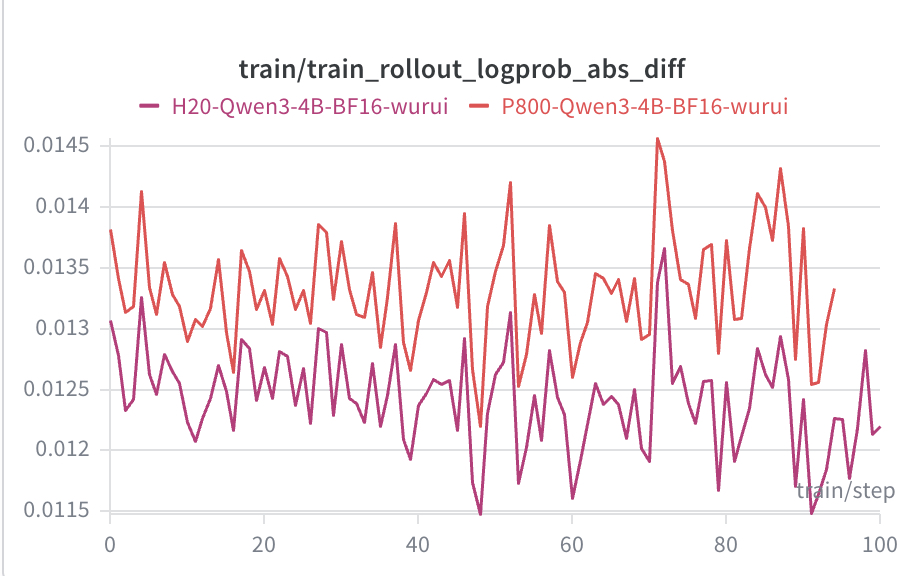
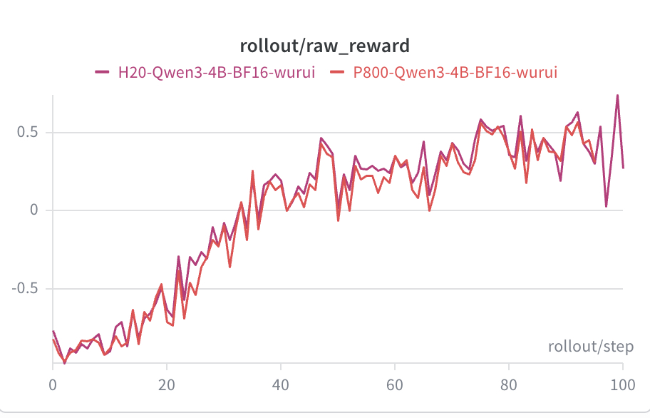
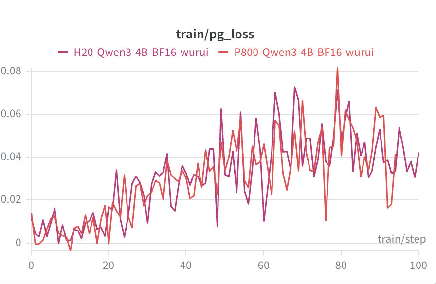
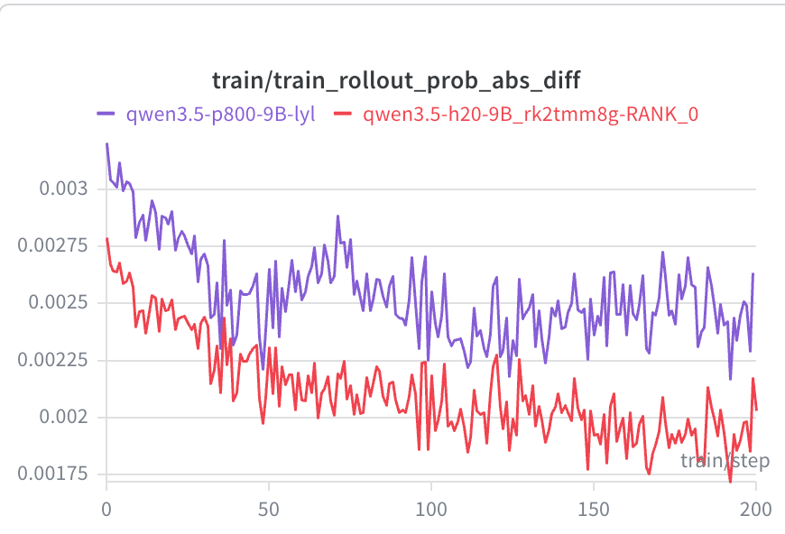
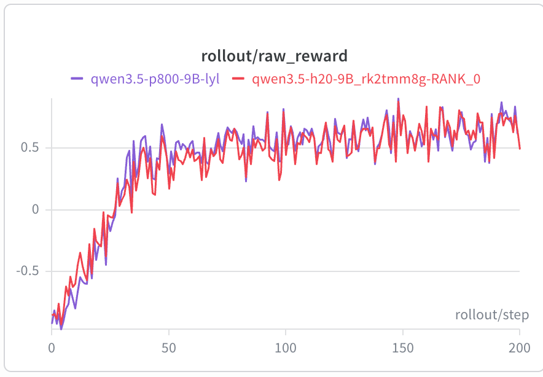
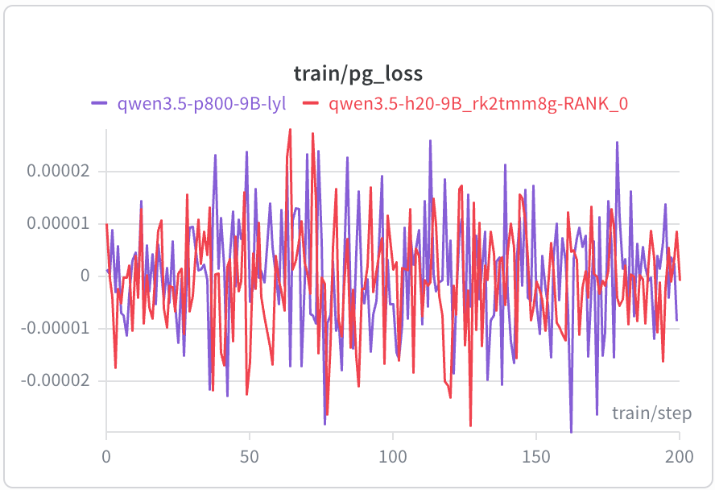
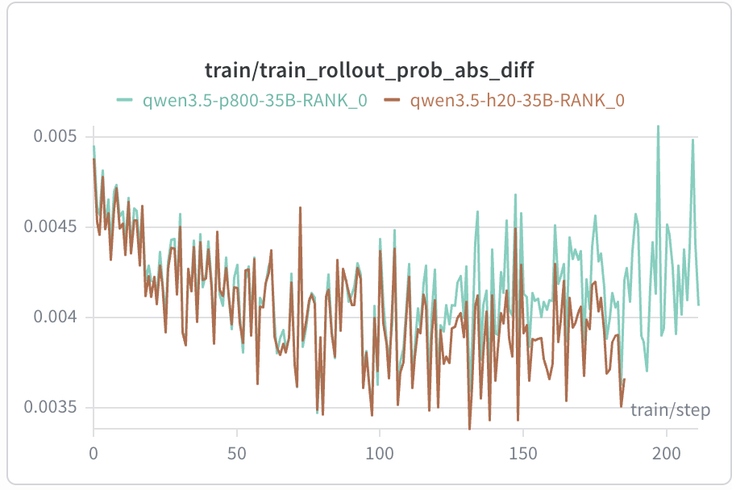
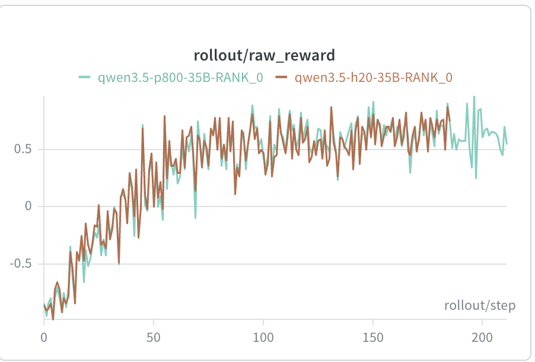
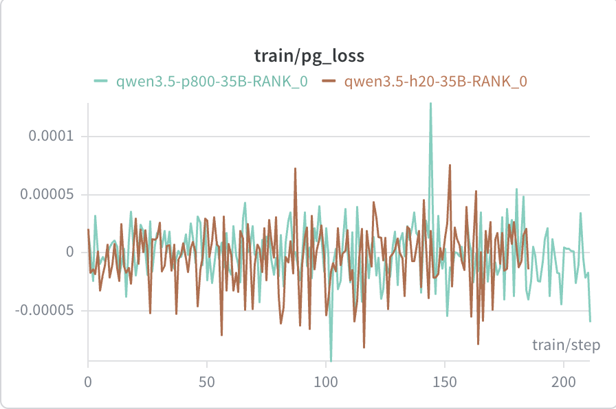

# XPU 训练指导

## 概述

本文档介绍在昆仑芯 XPU 算力节点上使用 Relax 框架训练业界主流开源大模型的完整流程。当前算力规格为昆仑芯 P800（8 卡单机）。

## 模型支持

| 模型       | 训练场景 | Sync | Async | 训练所需最小卡数 | 参考脚本                                              |
| ---------- | -------- | ---- | ----- | ---------------- | ----------------------------------------------------- |
| Qwen3-4B        | DAPO | √   | √   | P800 8 卡  | `scripts/training/text/run-qwen3-4B-8xP800.sh`         |
| Qwen3.5-9B      | DAPO | √   | √   | P800 8 卡  | `scripts/training/text/run-qwen35-9B-8xP800.sh`        |
| Qwen3.5-35B-A3B | DAPO | √   | √   | P800 16 卡 | `scripts/training/text/run-qwen35-35B-A3B-16xP800.sh`  |

> Async 模式：将上述脚本中的 `--colocate` 替换为 `--fully-async`，并按需调整 `--resource` 中 actor / rollout 的卡数切分（colocate 时同卡共享，async 时需要分开）。

## 环境准备

### 前置准备

- 资源类型：`Kunlunxin P800 (XPU)`
- 当前可用镜像：`iregistry.baidu-int.com/xpu/xrelax_torch29_ubuntu2204_xsgl0510_dev:20260610_12`
- 代码路径约定：**Relax 代码库必须放在容器内 `/workspace/Relax`**，文档及补丁中的路径均基于此前提

### 环境检查

```bash
xpu_smi                              # 查看 XPU 卡状态
xpu_smi -L | grep -c "XPU"           # 确认挂载卡数
```

### 安装方法

XPU 适配通过 patch 注入，目录结构如下：

```
docker/patch/xpu_patch/
├── megatron.patch     # Megatron-LM XPU 兼容补丁
└── relax.patch        # Relax 框架 XPU 兼容补丁（含 local.sh、actor.py、sglang.py 等）
```

应用补丁：

> **重要**：`relax.patch` 基于 commit `2100c156` 生成，`megatron.patch` 基于 Megatron-LM commit `85bced0ae` 生成；应用前必须先把对应仓库切到该提交，否则会因上下文不匹配而 `patch does not apply`。

```bash
# Relax：先切到 patch 基线再 apply
cd /workspace/Relax
git checkout 2100c156
git apply docker/patch/xpu_patch/relax.patch

# Megatron-LM
cd /workspace/Megatron-LM
git checkout 85bced0ae
git apply /workspace/Relax/docker/patch/xpu_patch/megatron.patch
```

`relax.patch` 涉及的关键改动：

- `scripts/entrypoint/local.sh`：注释 `set -eo pipefail`、NVLink 检测块、默认 `RUNTIME_ENV_JSON`，使其在 P800 主机上无需 NVLink / NVIDIA 工具即可顺利启动
- `relax/backends/megatron/actor.py`：暂以显式 CPU offload 替代 `torch_memory_saver.disable()`（XPU 适配持续推进中）；权重切换前重置 Hydrax 量化缓存；同时跳过 `save_checkpoint` / `update_weights` 周围的 `reload_process_groups` / `destroy_process_groups`（进程组动态重建暂不支持）
- `relax/backends/megatron/sglang.py`、`weight_conversion/processors/__init__.py`：当前 P800 暂不启用 fp8 / compressed-tensors 量化路径
- `relax/backends/megatron/weight_update/hf_weight_iterator_bridge.py`：bridge 权重导出沿用更稳定的旧版简化路径（下一版会修复）；并在 `get_hf_weight_chunks` 入口插入 `torch.cuda.synchronize()` 排空异步 H2D/D2H，确保 XPU 上首个 `.cuda()` 复制稳定执行
- `relax/backends/megatron/weight_update/update_weight_from_tensor.py`：tensor 更新前补充 `dist.barrier` 以保证 rank 同步
- `relax/distributed/ray/actor_group.py`：暂关闭 `TMS_INIT_ENABLE` 默认值（下一版tms会支持）
- `relax/utils/training/tensor_backper.py`：保守关闭 pinned memory，规避相关已知问题

## 启动配置

### 容器启动


```bash
CONTAINER_NAME="<自定义容器名>"
PROJECT="iregistry.baidu-int.com/xpu/xrelax_torch29_ubuntu2204_xsgl0510_dev:20260610_12"

# 拼接 8 张 XPU + xpuctrl
DOCKER_DEVICE_CONFIG=""
for ((idx=0; idx<8; idx++)); do
  DOCKER_DEVICE_CONFIG+=" --device=/dev/xpu${idx}:/dev/xpu${idx}"
done
DOCKER_DEVICE_CONFIG+=" --device=/dev/xpuctrl:/dev/xpuctrl"

docker run --privileged -it ${DOCKER_DEVICE_CONFIG} \
  --net=host \
  --cap-add=SYS_PTRACE --security-opt seccomp=unconfined \
  --tmpfs /dev/shm:rw,nosuid,nodev,exec,size=32g \
  --name ${CONTAINER_NAME} \
  ${PROJECT} /bin/bash
```

> ⦁ `--device=/dev/xpuX` / `/dev/xpuctrl`：XPU 卡及管理设备节点

> ⦁ `--tmpfs /dev/shm:size=32g`：BKCL / 多进程通信所需共享内存

> ⦁ 进入容器后将 Relax 代码库及相关数据 / 权重放置在 `/workspace` 下，本文档及 patch 中的路径均默认 Relax 位于 `/workspace/Relax`

### 训练启动

```bash
# Sync (colocate) mode
#qwen3-4B脚本
bash scripts/training/text/run-qwen3-4B-8xP800.sh
#qwen3.5-9B脚本
bash scripts/training/text/run-qwen35-9B-8xP800.sh
#qwen3.5-35B-A3B脚本
bash scripts/training/text/run-qwen35-35B-A3B-16xP800.sh
```

#### 关键配置

> ⦁ `MODEL_DIR`：HF 权重路径（`--hf-checkpoint` / `--ref-load`）

> ⦁ `PROMPT_SET`、`EVAL_DATA`：训练 / 评估数据集路径

> ⦁ `NUM_GPUS=8`：单机 8 卡

> ⦁ `BKCL_RDMA_NICS`：网卡配置

> ⦁ `WANDB_API_KEY`：wandb 在线上报使用的 API key（在线模式必填；离线训练可设 `WANDB_MODE=offline` 跳过）

#### 环境入口

> ⦁ `source scripts/entrypoint/local.sh`：单机本地拉起 Ray head 节点

> ⦁ `source scripts/entrypoint/local-qwen35-35B-A3B-16xP800.sh`：35B-A3B 双机（head + worker）拉起 Ray 集群，需 `export HEAD_IP=<head>` `export WORKER_NODES=<worker>`

### 跟h20对比结果

#### qwen3-4b

<table>
  <tr>
    <td></td>
    <td></td>
    <td></td>
  </tr>
</table>

#### qwen3.5-9b

<table>
  <tr>
    <td></td>
    <td></td>
    <td></td>
  </tr>
</table>

#### qwen3.5-35b-a3b

<table>
  <tr>
    <td></td>
    <td></td>
    <td></td>
  </tr>
</table>

## 下一步

- [ ] Qwen3.5-9B 性能优化
- [ ] Qwen3.5-35B-A3B 性能优化
